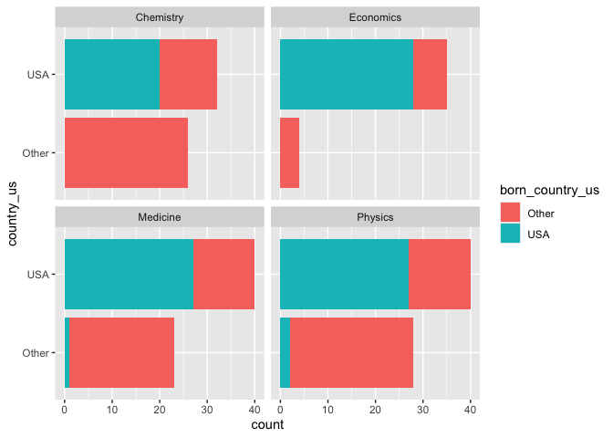

Lab 03 - Nobel laureates
================
Noah Booker
03/17/25

### Load packages and data

``` r
library(tidyverse) 
```

``` r
nobel <- read_csv("data/nobel.csv")
```

## Exercises

### Exercise 1

``` r
glimpse(nobel)
```

    ## Rows: 935
    ## Columns: 26
    ## $ id                    <dbl> 1, 2, 3, 4, 5, 6, 6, 8, 9, 10, 11, 12, 13, 14, 1…
    ## $ firstname             <chr> "Wilhelm Conrad", "Hendrik A.", "Pieter", "Henri…
    ## $ surname               <chr> "Röntgen", "Lorentz", "Zeeman", "Becquerel", "Cu…
    ## $ year                  <dbl> 1901, 1902, 1902, 1903, 1903, 1903, 1911, 1904, …
    ## $ category              <chr> "Physics", "Physics", "Physics", "Physics", "Phy…
    ## $ affiliation           <chr> "Munich University", "Leiden University", "Amste…
    ## $ city                  <chr> "Munich", "Leiden", "Amsterdam", "Paris", "Paris…
    ## $ country               <chr> "Germany", "Netherlands", "Netherlands", "France…
    ## $ born_date             <date> 1845-03-27, 1853-07-18, 1865-05-25, 1852-12-15,…
    ## $ died_date             <date> 1923-02-10, 1928-02-04, 1943-10-09, 1908-08-25,…
    ## $ gender                <chr> "male", "male", "male", "male", "male", "female"…
    ## $ born_city             <chr> "Remscheid", "Arnhem", "Zonnemaire", "Paris", "P…
    ## $ born_country          <chr> "Germany", "Netherlands", "Netherlands", "France…
    ## $ born_country_code     <chr> "DE", "NL", "NL", "FR", "FR", "PL", "PL", "GB", …
    ## $ died_city             <chr> "Munich", NA, "Amsterdam", NA, "Paris", "Sallanc…
    ## $ died_country          <chr> "Germany", "Netherlands", "Netherlands", "France…
    ## $ died_country_code     <chr> "DE", "NL", "NL", "FR", "FR", "FR", "FR", "GB", …
    ## $ overall_motivation    <chr> NA, NA, NA, NA, NA, NA, NA, NA, NA, NA, NA, NA, …
    ## $ share                 <dbl> 1, 2, 2, 2, 4, 4, 1, 1, 1, 1, 1, 1, 2, 2, 1, 1, …
    ## $ motivation            <chr> "\"in recognition of the extraordinary services …
    ## $ born_country_original <chr> "Prussia (now Germany)", "the Netherlands", "the…
    ## $ born_city_original    <chr> "Lennep (now Remscheid)", "Arnhem", "Zonnemaire"…
    ## $ died_country_original <chr> "Germany", "the Netherlands", "the Netherlands",…
    ## $ died_city_original    <chr> "Munich", NA, "Amsterdam", NA, "Paris", "Sallanc…
    ## $ city_original         <chr> "Munich", "Leiden", "Amsterdam", "Paris", "Paris…
    ## $ country_original      <chr> "Germany", "the Netherlands", "the Netherlands",…

The glimpse functions allows to see that this dataset has 935 rows
(observations; nobel laureates) and 26 columns (variables).

### Exercise 2

``` r
nobel_living <- nobel %>% 
  filter(
    is.na(died_date),
    !is.na(country),
    gender != "org")
glimpse(nobel_living)
```

    ## Rows: 228
    ## Columns: 26
    ## $ id                    <dbl> 68, 69, 95, 97, 98, 99, 101, 103, 106, 107, 111,…
    ## $ firstname             <chr> "Chen Ning", "Tsung-Dao", "Leon N.", "Leo", "Iva…
    ## $ surname               <chr> "Yang", "Lee", "Cooper", "Esaki", "Giaever", "Jo…
    ## $ year                  <dbl> 1957, 1957, 1972, 1973, 1973, 1973, 1974, 1975, …
    ## $ category              <chr> "Physics", "Physics", "Physics", "Physics", "Phy…
    ## $ affiliation           <chr> "Institute for Advanced Study", "Columbia Univer…
    ## $ city                  <chr> "Princeton NJ", "New York NY", "Providence RI", …
    ## $ country               <chr> "USA", "USA", "USA", "USA", "USA", "United Kingd…
    ## $ born_date             <date> 1922-09-22, 1926-11-24, 1930-02-28, 1925-03-12,…
    ## $ died_date             <date> NA, NA, NA, NA, NA, NA, NA, NA, NA, NA, NA, NA,…
    ## $ gender                <chr> "male", "male", "male", "male", "male", "male", …
    ## $ born_city             <chr> "Hofei Anhwei", "Shanghai", "New York NY", "Osak…
    ## $ born_country          <chr> "China", "China", "USA", "Japan", "Norway", "Uni…
    ## $ born_country_code     <chr> "CN", "CN", "US", "JP", "NO", "GB", "GB", "US", …
    ## $ died_city             <chr> NA, NA, NA, NA, NA, NA, NA, NA, NA, NA, NA, NA, …
    ## $ died_country          <chr> NA, NA, NA, NA, NA, NA, NA, NA, NA, NA, NA, NA, …
    ## $ died_country_code     <chr> NA, NA, NA, NA, NA, NA, NA, NA, NA, NA, NA, NA, …
    ## $ overall_motivation    <chr> NA, NA, NA, NA, NA, NA, NA, NA, NA, NA, NA, NA, …
    ## $ share                 <dbl> 2, 2, 3, 4, 4, 2, 2, 3, 2, 3, 4, 4, 3, 3, 2, 1, …
    ## $ motivation            <chr> "\"for their penetrating investigation of the so…
    ## $ born_country_original <chr> "China", "China", "USA", "Japan", "Norway", "Uni…
    ## $ born_city_original    <chr> "Hofei Anhwei", "Shanghai", "New York NY", "Osak…
    ## $ died_country_original <chr> NA, NA, NA, NA, NA, NA, NA, NA, NA, NA, NA, NA, …
    ## $ died_city_original    <chr> NA, NA, NA, NA, NA, NA, NA, NA, NA, NA, NA, NA, …
    ## $ city_original         <chr> "Princeton NJ", "New York NY", "Providence RI", …
    ## $ country_original      <chr> "USA", "USA", "USA", "USA", "USA", "United Kingd…

Created a new data frame called nobel_living which includes only nobel
winners wha haven’t died, for whom country is available, and who are not
an organization.

### Exercise 3

``` r
nobel_living <- nobel_living %>%
  mutate(
    country_us = if_else(country == "USA", "USA", "Other")
  )
nobel_living_science <- nobel_living %>%
  filter(category %in% c("Physics", "Medicine", "Chemistry", "Economics"))
ggplot(nobel_living_science, aes(x = country_us)) +
  geom_bar() +
  facet_wrap(~ category) +
  coord_flip()
```

<!-- -->

In the barplot, we see that, for each category, most living Nobel
laureates were based in the US when they won their prizes. This aligns
with the Buzzfeed article’s claim.

### Exercise 4

``` r
nobel_living_science <- nobel_living_science %>% 
  mutate(
    born_country_us = if_else(born_country == "USA", "USA", "Other")
  )
nobel_living_science %>% 
  count(born_country_us)
```

    ## # A tibble: 2 × 2
    ##   born_country_us     n
    ##   <chr>           <int>
    ## 1 Other             123
    ## 2 USA               105

105 winners were born in the US, and 123 were born elsewhere.

### Exercise 5

``` r
ggplot(nobel_living_science, aes(x = country_us, fill = born_country_us)) +
  geom_bar() +
  facet_wrap(~ category) +
  coord_flip()
```

<!-- -->

Based on this barplot, Buzzfeed’s claim that “But of those US-based
Nobel laureates, many were born in other countries,” appears to be true.
The barplot shows that, for each category, for living laureates based in
the US at the time of their prize, there is a proportion who were born
in countries other than the US.

### Exercise 6

``` r
nobel_living_science %>%
  filter(
    country == "USA", 
    born_country != "USA") %>% 
  count(born_country) %>% 
  arrange(desc(n))
```

    ## # A tibble: 21 × 2
    ##    born_country       n
    ##    <chr>          <int>
    ##  1 Germany            7
    ##  2 United Kingdom     7
    ##  3 China              5
    ##  4 Canada             4
    ##  5 Japan              3
    ##  6 Australia          2
    ##  7 Israel             2
    ##  8 Norway             2
    ##  9 Austria            1
    ## 10 Finland            1
    ## # ℹ 11 more rows

For living Nobel laureates in Physics, Medicine, Chemistry, and
Economics who were based in the US when they won their prize but were
born in a country other than the US, the highest number were from
Germany and the United Kingdom (tied for first place, each with 7
laureates).
